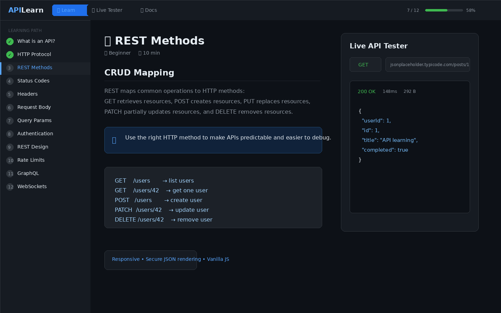

# APILearn — Interactive API Learning & Testing Playground

APILearn is a clean, browser-based learning app for understanding modern APIs from fundamentals to real-world request testing. It combines a structured API course, an interactive HTTP request builder, quick public API examples, searchable documentation, and request logging in a lightweight static web app.



> A zero-build, zero-dependency API learning playground designed for students, junior developers, bootcamp learners, and anyone who wants to understand REST APIs hands-on.

## ✨ Features

- Structured API course with 12 chapters from beginner to advanced
- Live API tester supporting `GET`, `POST`, `PUT`, `PATCH`, `DELETE`, `HEAD`, and `OPTIONS`
- Request builder with query params, headers, JSON body, and auth options
- Auth helpers for Bearer Token, API Key Header, and Basic Auth
- Response viewer with formatted JSON, response headers, status badge, timing, and response size
- Request log panel for inspecting previous requests and responses
- Quick examples using public APIs such as JSONPlaceholder, HTTPBin, PokéAPI, REST Countries, and GitHub API
- Searchable documentation with API method references, auth notes, status codes, and roadmap guidance
- Progress tracking using `localStorage`
- Responsive GitHub-inspired dark UI
- Frontend-only app with no build step and no external dependencies

## 🧠 What You Can Learn

APILearn covers core API concepts including HTTP, REST methods, status codes, headers, CORS, JSON bodies, query parameters, authentication, pagination, rate limits, GraphQL basics, and WebSockets.

## 🧪 Live Tester Capabilities

| Area | Support |
| --- | --- |
| Methods | GET, POST, PUT, PATCH, DELETE, HEAD, OPTIONS |
| Params | Dynamic key/value query parameters |
| Headers | Custom request headers |
| Body | Raw JSON body for write requests |
| Auth | No Auth, Bearer Token, API Key Header, Basic Auth |
| Response | Body, headers, status code, duration, size |
| Logs | Request and response history |

> Some APIs block browser-based requests because of CORS. APIs such as JSONPlaceholder and HTTPBin are good options for testing in the browser.

## 🚀 Getting Started

No installation is required.

### Open directly

```bash
git clone https://github.com/your-username/apilearn.git
cd apilearn
open index.html
```

On Windows, open `index.html` manually in your browser.

### Serve locally

For the best browser behavior, serve the project from a local web server:

```bash
python -m http.server 8000
```

Then open:

```text
http://localhost:8000
```

## 🌐 Deploy on GitHub Pages

1. Push the project to a public GitHub repository.
2. Go to **Settings → Pages**.
3. Select **Deploy from a branch**.
4. Choose the `main` branch and root folder.
5. Save and open the generated GitHub Pages URL.

After deployment, replace this with your live demo URL:

```text
https://khodevex.github.io/Live-learn-and-test-APIs/
```

## 📁 Project Structure

```text
apilearn/
├── index.html
├── css/
│   └── styles.css
├── js/
│   └── app.js
├── assets/
│   └── screenshot.png
├── docs/
│   └── roadmap.md
├── README.md
├── LICENSE
├── .gitignore
└── .nojekyll
```

## 🛠️ Tech Stack

- HTML5
- CSS3
- Vanilla JavaScript
- Browser Fetch API
- LocalStorage
- Public REST APIs for practice

No frameworks, package managers, build tools, or backend services are required.

## 🔒 Security Notes

APILearn is a frontend-only learning tool. Do not use real production secrets in the tester.

Implemented safety improvements:

- API JSON responses are escaped before syntax-highlighted HTML is injected into the DOM.
- User-entered URLs are escaped before being rendered in log attributes.
- JSON request bodies are validated before write requests are sent.
- The project includes clear guidance not to expose real API keys or tokens.

Best practices:

- Never commit API keys or access tokens to GitHub.
- Avoid testing sensitive production endpoints from the browser.
- Use public demo APIs for learning and examples.
- Prefer server-side API calls when working with private credentials.

## 🎯 Why This Project Is Useful

This project is especially useful for students learning APIs for the first time, junior frontend developers practicing REST requests, bootcamp portfolio projects, teaching sessions, and quick HTTP method/status-code demonstrations.

## 🧩 Roadmap Ideas

- Import/export request collections
- Saved request collections similar to Postman
- Environment variables for base URLs and tokens
- Generated snippets for `fetch`, `curl`, and Axios
- Automated tests with Playwright or Cypress
- More accessibility enhancements and keyboard shortcuts

## 🤝 Contributing

Contributions, suggestions, and improvements are welcome. Feel free to open an issue or submit a pull request.

## 📄 License

This project is released under the MIT License.

## 👤 Author

Created by **KhodeVex**

- GitHub: `https://github.com/khodevex`
- Portfolio: `https://khodevex.pages.dev/`
